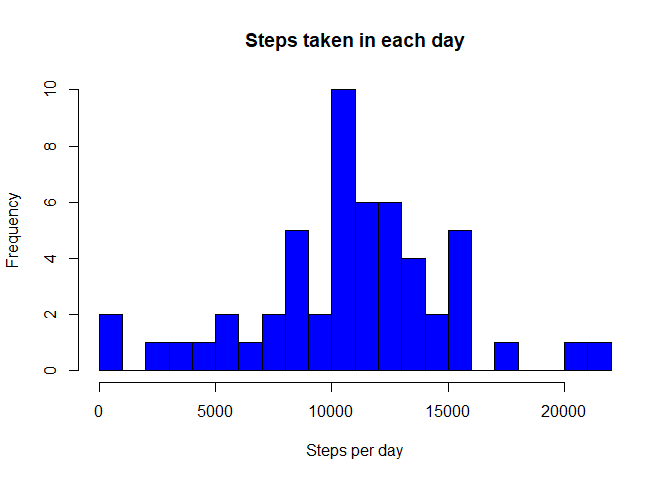
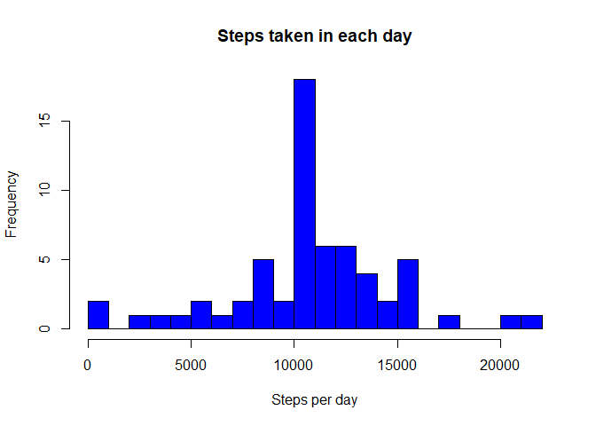
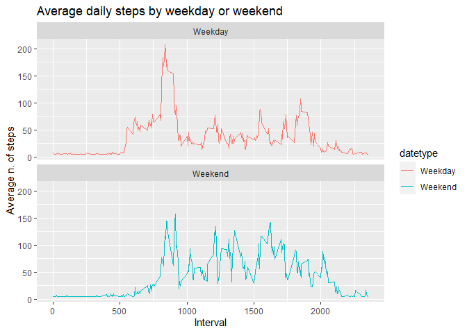

# Assignment 1 - Reproducible Research

# 1) Loading and preprocessing the data

The data is downloaded from the website and is located on the
corresponding folder. Afterwards, it’s unzipped and the missing values
are ommited.

    file <- "repdata_data_activity.zip"
    if (!file.exists(file)) {
      download <- "https://d396qusza40orc.cloudfront.net/repdata%2Fdata%2Factivity.zip"
     download.file(download, destfile = file)
     unzip (zipfile = file)
    }
    data_original_form <- read.csv("activity.csv", header = TRUE)
    working_data <- na.omit(data_original_form)
    head(working_data)

    ##     steps       date interval
    ## 289     0 2012-10-02        0
    ## 290     0 2012-10-02        5
    ## 291     0 2012-10-02       10
    ## 292     0 2012-10-02       15
    ## 293     0 2012-10-02       20
    ## 294     0 2012-10-02       25

# 2) What is mean total number of steps taken per day?

First, the total number of daily steps is calculated by aggregating the
steps for each day

    steps_day <- aggregate(working_data$steps, by = list(Steps.Date = working_data$date), FUN = "sum")

Second, a histogram is constructed, which shows the frequency of the
different number of steps per day

    hist(steps_day$x, col = "blue", 
         breaks = 30,
         main = "Steps taken in each day",
         xlab = "Steps per day")

The mean and median number of steps are calculated. Here we observe that
they are slightly different.

    mean(steps_day[,2], na.rm = TRUE)

    ## [1] 10766.19

    median(steps_day[,2], na.rm = TRUE)

    ## [1] 10765

# 3) What is the average daily activity pattern?

The average daily activity pattern is obtained by calculating the mean
of the steps for each 5-minute interval.

    average_activity <- aggregate(working_data$steps, 
                              by = list(Interval = working_data$interval), 
                              FUN = "mean")
    plot(average_activity$Interval, average_activity$x, type = "l", 
         main = "Average daily activity", 
         ylab = "Avarage steps", 
         xlab = "5 minutes intervals")

Which 5-minute interval, on average across all the days in the dataset,
contains the maximum number of steps?

Afterwards, we identify the 5-minute interval which is associated with
the maximum number of average steps.

    interval_max <- which.max(average_activity$x)
    max_interval <- average_activity[interval_max,1]
    print (max_interval)

    ## [1] 835

# 4) Imputing missing values

The number of missing values is identified and tabulated.

    missing_values <- is.na(data_original_form$steps)
    table(missing_values)

    ## missing_values
    ## FALSE  TRUE 
    ## 15264  2304

The missing values are imputed with the mean for the 5-min interval
using the HMISC package.

    library(Hmisc)

    ## Warning: package 'Hmisc' was built under R version 4.0.5

    ## Loading required package: lattice

    ## Warning: package 'lattice' was built under R version 4.0.5

    ## Loading required package: survival

    ## Warning: package 'survival' was built under R version 4.0.5

    ## Loading required package: Formula

    ## Loading required package: ggplot2

    ## Warning: package 'ggplot2' was built under R version 4.0.5

    ## 
    ## Attaching package: 'Hmisc'

    ## The following objects are masked from 'package:base':
    ## 
    ##     format.pval, units

    original_data_filled <- data_original_form
    original_data_filled$steps <- impute(data_original_form$steps, fun=mean)
    head(original_data_filled)

    ##     steps       date interval
    ## 1 37.3826 2012-10-01        0
    ## 2 37.3826 2012-10-01        5
    ## 3 37.3826 2012-10-01       10
    ## 4 37.3826 2012-10-01       15
    ## 5 37.3826 2012-10-01       20
    ## 6 37.3826 2012-10-01       25

The histogram of the total number of steps generated with the new
imputed database is calculated.

    steps_day_imputed <- aggregate(original_data_filled$steps, by = list(Steps.Date = original_data_filled$date), FUN = "sum")
    hist(steps_day_imputed$x, col = "blue", 
         breaks = 30,
         main = "Steps taken in each day",
         xlab = "Steps per day")

The mean and the median are reported, which right now are equal.

    mean(steps_day_imputed[,2], na.rm = TRUE)

    ## [1] 10766.19

    median(steps_day_imputed[,2], na.rm = TRUE)

    ## [1] 10766.19

# 5) Are there differences in activity patterns between weekdays and weekends?

A new factor variable is created. This variable indicates if the
specific date belongs to a weekday or a weekend.

    original_data_filled$date <- as.Date(strptime(original_data_filled$date, format="%Y-%m-%d"))
    original_data_filled$datetype <- sapply(original_data_filled$date, function(x) {
      if (weekdays(x) == "Saturday" | weekdays(x) =="Sunday") 
      {y <- "Weekend"} else 
      {y <- "Weekday"}
      y
    })
    head(original_data_filled)

    ##     steps       date interval datetype
    ## 1 37.3826 2012-10-01        0  Weekday
    ## 2 37.3826 2012-10-01        5  Weekday
    ## 3 37.3826 2012-10-01       10  Weekday
    ## 4 37.3826 2012-10-01       15  Weekday
    ## 5 37.3826 2012-10-01       20  Weekday
    ## 6 37.3826 2012-10-01       25  Weekday

Finally, time series plot showing the average number of steps (y axis)
by interval (x axis) for weekdays and weekends are generated

    activity_date <- aggregate(steps~interval + datetype, original_data_filled, mean, na.rm = TRUE)
    plot<- ggplot(activity_date, aes(x = interval , y = steps, color = datetype)) +
      geom_line() +
      labs(title = "Average daily steps by weekday or weekend", x = "Interval", y = "Average n. of steps") +
      facet_wrap(~datetype, ncol = 1, nrow=2)
    print(plot)

